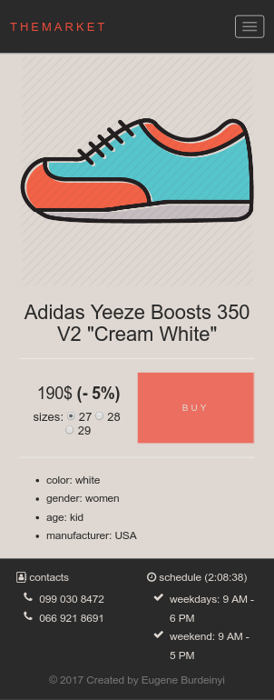

<h1 align="center">themarket</h1>

## About

This course of laboratory works is intended to create a basic web store

## Releases

- 0.1 - HTML &amp; CSS: creating home, authentication and registration pages
- 0.2 - Improving JS functionality: form validation &amp; clock widget
- 0.3 - BOM: getting information about user agent and displaying it after registration
- 0.4 - PHP: registration, authentication, user accounting
- 0.5 - PHP: products &amp; brands administration
- 0.6 - PHP: shopping cart

## Notes

- i'm using a **dumbass authentication system**, so strong and reliable authorization is out of question. literally everyone can falsify their cookies and obtain administrator privileges
- forgot to add database dump
- search is not working
- you cannot add photos of shoes
- payment functionality is not provided
- single sizing chart only
- no pagination

## Database structure

## Screenshots

